#  Introduction to Magics

[Magics](https://confluence.ecmwf.int/display/MAGP/Magics) is the latest generation of the ECMWF's meteorological plotting software. It offers an easy way to visualise data coded in meteorological formats such as GRIB, NetCDF and BUFR.

Its simple python interface allows users to quickly setup projection and geographical areas and apply easily a defined visualisation. 

This gallery of tutorials and examples will help discover its functionality

  - Easy visualisation of [GRIB data](basic/grib.ipynb)
  - Easy visualisation of [NetCDF data](basic/netcdf.ipynb)
  - Easy visualisation of xarray data

## Tutorials

| Setting the  geographical view     | Customise coastlines    | Introduction to contouring   [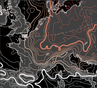](tutorials/Contours_lines.ipynb) |    
|:---:|:---:|:---:|
|**Introduction to shading**   [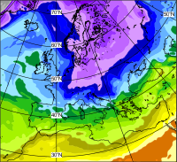](tutorials/Contours_shading.ipynb) |  **Introduction to automatic shading**   [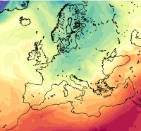](tutorials/Contours_automtatic.ipynb)| **Legend customization**   [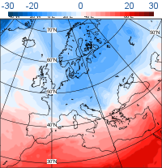](tutorials/Legend.ipynb) |
|**Introduction to Symbols plotting**   [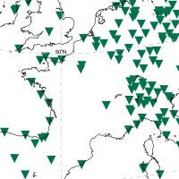](tutorials/Symbol_simple.ipynb) |  **Advanced Symbols plotting**   [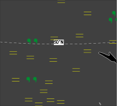](tutorials/Symbol_advanced.ipynb)| **Introduction to wind plotting**   [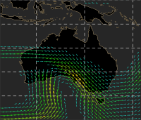](tutorials/Wind.ipynb) |
|**Introduction to Text plotting**   [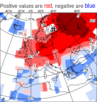](tutorials/Text.ipynb) | **A complex layout**   [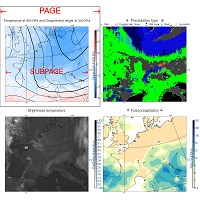](tutorials/A_complex_layout.ipynb) |  |

## Gallery 

| Cylindrical projection     | Europe on Stereographic projection    | **Boundaries and rivers**    |
|:---:|:---:|:---:|
| **High resolution coastline**   [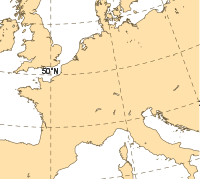](gallery/high_resolution_coastline.ipynb)|  **Sea, lakes and rivers**   | **Boundaries, cities and rivers**   [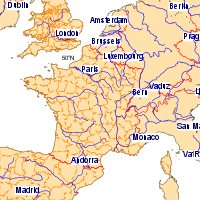](gallery/boundaries_cities_rivers.ipynb) |
| **Simple shading**   [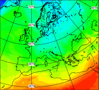](gallery/simple_shading.ipynb)|  **Colour list**   | **Level and colour list**    |
| **Gradients method 1**   [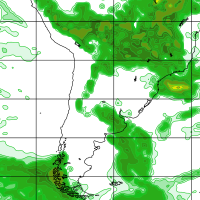](gallery/gradients1.ipynb) | **Gradients method 2**    | **Palette method**    |
