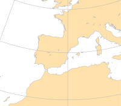
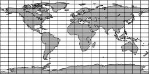
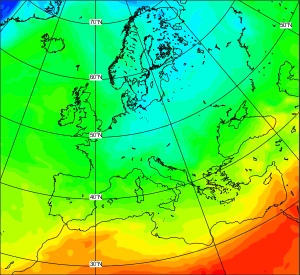

#  Introduction to Magics

[Magics](https://confluence.ecmwf.int/display/MAGP/Magics) is the latest generation of the ECMWF's meteorological plotting software. It offers an easy way to visualise data coded in meteorological formats such as GRIB, NetCDF and BUFR.

Its simple python interface allows users to quickly setup projection and geographical areas and apply easily a defined visualisation. 

This gallery of tutorials and examples will help discover its functionality

  - Easy visualisation of [GRIB data](basic/grib.ipynb)
  - Easy visualisation of [NetCDF data](basic/netcdf.ipynb)
  - Easy visualisation of xarray data

## Tutorials

| Setting the  geographical view     | Customise coastlines    | Introduction to contouring    |
|---|---|---|

## Gallery 

| Cylindrical projection     | Europe on Stereographic projection    | Simple shading    |
|---|---|---|

  
